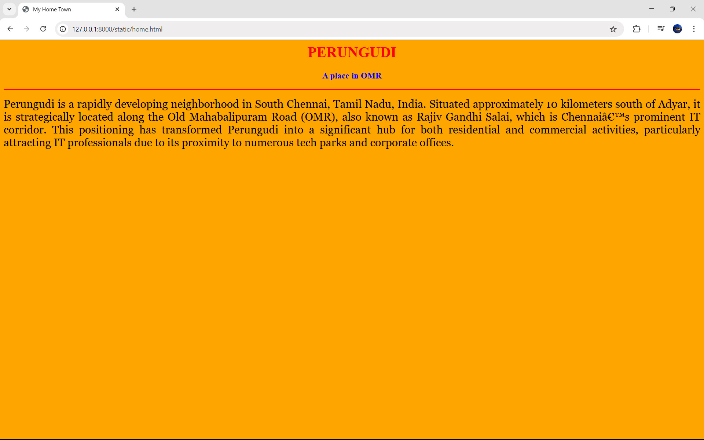
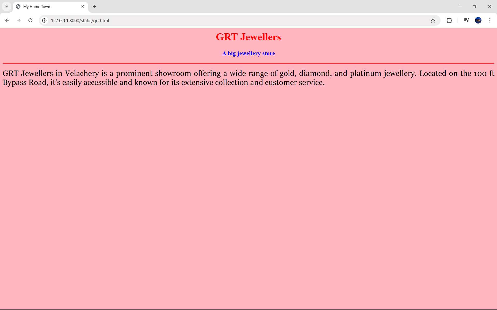
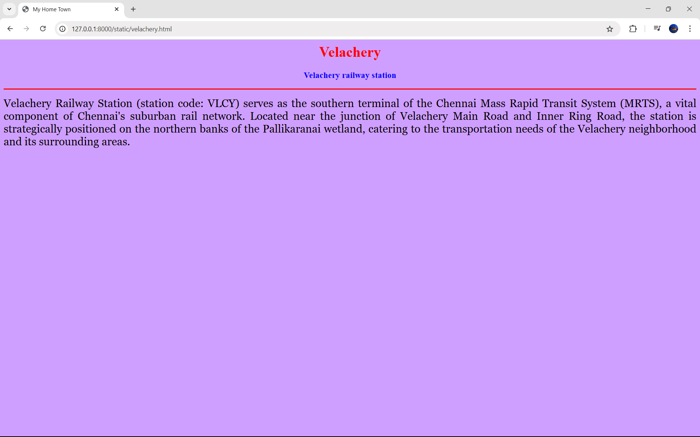

# Ex04 Places Around Me
## Date: 28.04.2025

## AIM
To develop a website to display details about the places around my house.

## DESIGN STEPS

### STEP 1
Create a Django admin interface.

### STEP 2
Download your city map from Google.

### STEP 3
Using ```<map>``` tag name the map.

### STEP 4
Create clickable regions in the image using ```<area>``` tag.

### STEP 5
Write HTML programs for all the regions identified.

### STEP 6
Execute the programs and publish them.

## CODE

```
map.html

<html>
<head>
<title>My City</title>
</head>
<body>
<h1 align="center">
<font color="red"><b>PERUNGUDI</b></font>
</h1>
<h3 align="center">
<font color="blue"><b> NISHANTH R S (212224040223)</b></font>
</h3>
<center>
    

    <map name="map">
      <area shape="rect" coords="655,340,695,380" href="home.html" title="Perungudi">
      <area shape="rect" coords="630,300,700,420" href="tradecenter.html" title="World Trade Center Chennai">
      <area shape="rect" coords="900,300,700,420" href="palavakkambeach.html" title="Palavakkam Beach">
      <area shape="rect" coords="250,90,360,130" href="grt.html" title="GRT Jewellers Velachery">
      <area shape="rect" coords="150,320,695,380" href="velachery.html" title="Velachery railway station">
    </map>
</center>
</body>
</html>

home.html

<html>
<head> 
    <title>My Home Town</title> 
</head> 
    <body bgcolor="orange"> 
    <h1 align="center"> 
    <font color="red"><b>PERUNGUDI</b></font> 
    </h1> 
    <h3 align="center"> 
    <font color="blue"><b>A place in OMR</b></font> 
    </h3> 
    <hr size="3" color="red"> 
    <p align="justify"> 
    <font face="Georgia" size="5"> 
        Perungudi is a rapidly developing neighborhood in South Chennai, Tamil Nadu, India. Situated approximately 10 kilometers south of Adyar, it is strategically located along the Old Mahabalipuram Road (OMR), also known as Rajiv Gandhi Salai, which is Chennai’s prominent IT corridor. This positioning has transformed Perungudi into a significant hub for both residential and commercial activities, particularly attracting IT professionals due to its proximity to numerous tech parks and corporate offices. 
    </p> 
    </body> 
</html>

tradecenter.html

<html>
<head> 
    <title>My Home Town</title> 
    </head> 
    <body bgcolor="#CBC3E3"> 
    <h1 align="center"> 
    <font color="red"><b>World trade center</b></font> 
    </h1> 
    <h3 align="center"> 
    <font color="blue"><b>A corporate company</b></font> 
    </h3> 
    <hr size="3" color="red"> 
    <p align="justify"> 
    <font face="Georgia" size="5"> 
        The World Trade Center (WTC) Chennai is a premier commercial complex located in Perungudi, along Chennai’s IT corridor on Old Mahabalipuram Road (OMR). Developed by Brigade Group in partnership with Singapore’s GIC, it stands as a significant landmark in the city’s business landscape.The WTC Chennai offers over 1.8 million square feet of premium office space, along with amenities such as a conference/exhibition center, retail spaces, and hospitality services. The complex is designed to accommodate approximately 20,000 to 25,000 employees upon full operation.
    </p> 
    </body> 
</html>

palavakkambeach.html

<html>
<head> 
    <title>My Home Town</title> 
    </head> 
    <body bgcolor="#87CEEB"> 
    <h1 align="center"> 
    <font color="red"><b>Palavakkam beach</b></font> 
    </h1> 
    <h3 align="center"> 
    <font color="blue"><b>A beach in ecr</b></font> 
    </h3> 
    <hr size="3" color="red"> 
    <p align="justify"> 
    <font face="Georgia" size="5"> 
        Palavakkam Beach is a serene coastal stretch located in the southern part of Chennai, nestled between Thiruvanmiyur and Neelankarai. Known for its tranquil ambiance, it's a favored spot for locals seeking relaxation and recreation.The beach is renowned for its mesmerizing sunsets, where the sky transforms into a canvas of vibrant hues, providing a picturesque backdrop for evening strolls.
    </p> 
    </body> 
</html>

grt.html

<html>
<head> 
    <title>My Home Town</title> 
    </head> 
    <body bgcolor="#FFB6C1"> 
    <h1 align="center"> 
    <font color="red"><b>GRT Jewellers</b></font> 
    </h1> 
    <h3 align="center"> 
    <font color="blue"><b>A big jewellery store</b></font> 
    </h3> 
    <hr size="3" color="red"> 
    <p align="justify"> 
    <font face="Georgia" size="5"> 
        GRT Jewellers in Velachery is a prominent showroom offering a wide range of gold, diamond, and platinum jewellery. Located on the 100 ft Bypass Road, it's easily accessible and known for its extensive collection and customer service.
    </p> 
    </body> 
</html>

velachery.html

<html>
<head> 
    <title>My Home Town</title> 
    </head> 
    <body bgcolor="#CF9FFF"> 
    <h1 align="center"> 
    <font color="red"><b>Velachery</b></font> 
    </h1> 
    <h3 align="center"> 
    <font color="blue"><b>Velachery railway station</b></font> 
    </h3> 
    <hr size="3" color="red"> 
    <p align="justify"> 
    <font face="Georgia" size="5"> 
        Velachery Railway Station (station code: VLCY) serves as the southern terminal of the Chennai Mass Rapid Transit System (MRTS), a vital component of Chennai's suburban rail network. Located near the junction of Velachery Main Road and Inner Ring Road, the station is strategically positioned on the northern banks of the Pallikaranai wetland, catering to the transportation needs of the Velachery neighborhood and its surrounding areas.
    </p> 
    </body> 
</html>

```

## OUTPUT










## RESULT
The program for implementing image maps using HTML is executed successfully.
